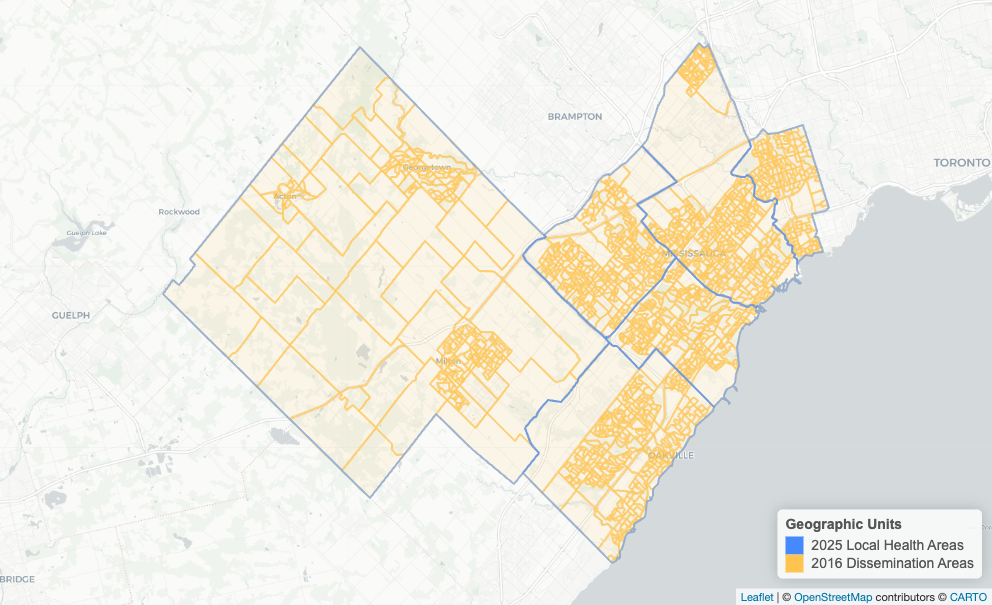

## Introduction

These geographic crosswalks were developed to link dissemination areas (DA) and 6-character postal codes to higher-level geographies, such as census divisions (CD), census subdivisions (CSD), Peel Health Data Zones (PHDZ), and local health areas (LHA).

### Census Geography Crosswalk

The census geography crosswalks link dissemination areas to larger hierarchically nested geographies, enabling dissemination areas to be aggregated to the following higher-level geographies:

#### 2016 Dissemination Areas

```         
2016 Dissemination Area to 2024 Peel Health Data Zone
├── 2016 Dissemination Area
├── 2016 Census Division
├── 2016 Census Subdivision
└── 2024 Peel Health Data Zone
```


```         
2016 Dissemination Area to 2025 Local Health Area
├── 2016 Dissemination Area
├── 2016 Census Division
├── 2016 Census Subdivision
└── 2025 Local Health Area
```



#### 2021 Dissemination Areas

```         
2021 Dissemination Area to 2024 Peel Health Data Zone
├── 2021 Dissemination Area
├── 2021 Census Division
├── 2021 Census Subdivision
└── 2024 Peel Health Data Zone
```


```         
2021 Dissemination Area to 2025 Local Health Area
├── 2021 Dissemination Area
├── 2021 Census Division
├── 2021 Census Subdivision
└── 2025 Local Health Area
```


### Postal Code Crosswalk

The postal code crosswalk provides a direct linkage between a 6-character postal code to the following higher-level geographies:

```         
6-Character Postal Code
├── 2016 Census Division
├── 2016 Census Subdivision
├── 2016 Dissemination Area
├── 2021 Census Division
├── 2021 Census Subdivision
├── 2021 Dissemination Area
├── 2024 Peel Health Data Zone
└── 2025 Local Health Area
```

#### Peel Postal Codes

The postal code crosswalk contains all active postal codes located within the Peel census division as of the PCCF December 2022 Release file. (Postal codes can become active or retired over time.)


#### LHA Postal Codes

To support additional analyses, the crosswalk also includes postal codes from the Mississauga North West, Mississauga East, Mississauga South West, Milton-Halton Hills, Oakville and Toronto South Etobicoke local health areas.


## Technical Specifications

### Crosswalk File Locations

```         
Geospatial Crosswalk/
├── Code/
├── Data/
├── Documents/
├── Figures/
├── Geospatial Crosswalk.Rproj
├── Images/
├── README/
└── Tables/
    ├── da16_phdz24_crosswalk - ver. YYYY-MM-DD.csv
    ├── da16_lha25_crosswalk  - ver. YYYY-MM-DD.csv
    ├── da21_phdz24_crosswalk - ver. YYYY-MM-DD.csv
    ├── da21_lha25_crosswalk  - ver. YYYY-MM-DD.csv
    └── postal_code_crosswalk - ver. YYYY-MM-DD.csv
```

### Dissemination Area Crosswalk

DA linkages to CD, CSD, PHDZ, and LHA were performed using geographic data and spatial joins to associate DAs with higher-level geographies. Spatial joins were verified to reconcile geographic boundaries that are not perfectly nested or aligned and to ensure the completeness of DAs assigned to higher-level geographies.

| Source | Release Date | Census Geography | Type | Variable | Description |
|------------|------------|------------|------------|--------------|------------|
| StatCan | Sep. 2017 | 2016 | Character | DAUID16 | Dissemination area unique identifier. The DAuid uniquely identifies a dissemination area. It is composed of the two-digit province or territory code, the two-digit census division code and the four-digit dissemination area code. |
| StatCan | Sep. 2017 | 2016 | Character | CDUID16 | Census division unique identifier. This uniquely identifies a census division. The first two digits of the CDuid identify the province or territory. |
| StatCan | Sep. 2017 | 2016 | Character | CDNAME16 | Census division name. |
| StatCan | Sep. 2017 | 2016 | Character | CSDUID16 | Census subdivision unique identifier. This uniquely identifies a census subdivision in the country. The province/territory, census division, and census subdivision (municipality) codes combine to represent the Standard Geographical Classification (SGC). |
| StatCan | Sep. 2017 | 2016 | Character | CSDNAME16 | Census subdivision name (municipality). |
| StatCan | Feb. 2022 | 2021 | Character | DAUID21 | Dissemination area unique identifier. The DAuid uniquely identifies a dissemination area. It is composed of the two-digit province or territory code, the two-digit census division code and the four-digit dissemination area code. |
| StatCan | Feb. 2022 | 2021 | Character | CDUID21 | Census division unique identifier. This uniquely identifies a census division. The first two digits of the CDuid identify the province or territory. |
| StatCan | Feb. 2022 | 2021 | Character | CDNAME21 | Census division name. |
| StatCan | Feb. 2022 | 2021 | Character | CSDUID21 | Census subdivision unique identifier. This uniquely identifies a census subdivision in the country. The province/territory, census division, and census subdivision (municipality) codes combine to represent the Standard Geographical Classification (SGC). |
| StatCan | Feb. 2022 | 2021 | Character | CSDNAME21 | Census subdivision name (municipality). |
| PHDZ | Feb. 2024 | 2016 | Character | PHDZ24 | Peel Health Data Zone unique identifier. |
| PHDZ | Feb. 2024 | 2016 | Character | PHDZMUNICIPALITY24 | Peel Health Data Zone municipality (census subdivision name). |
| PSG | Feb. 2025 | 2016 | Character | LHA25 | Local health area. |

: {.striped tbl-colwidths="[5, 9, 12, 8, 14, 52]"}

### Postal Code Crosswalk

Postal code linkages to 2021 CD, CSD, and DA were directly extracted from the PCCF December 2022 Release file. Postal code linkages to 2016 DA, 2024 PHDZ, and 2025 LHA were performed manually using geospatial point-in-polygon analysis. (The 2016 DA file also included 2016 CD and CSD higher-level geographic areas.) A 6-character postal code was assigned to a higher-level geography if the postal code’s latitude and longitude were within the boundary of the higher-level geography (i.e., a spatial intersect join).

Postal codes span an area and can span multiple census geographies. The PCCF file contains a Single Link Indicator (SLI) field. The single link indicator identifies the geographic area with the majority of the population and provides a geographic record for mapping a postal code representative point. The SLI can be used to establish a one-to-one relationship between postal codes and dissemination areas, dissemination blocks, or blockfaces. Spatial joins were performed using the coordinates of postal codes with SLIs. In contrast, the PCCF+ is a SAS program that uses a population-weighted random allocation to assign a postal code to a geographic area.

| Source | Release Date | Census Geography | Type | Variable | Description |
|------------|------------|------------|------------|--------------|------------|
| PCCF | Dec. 2022 | 2021 | Character | POSTALCODE21 | The postal code is a six-character code defined and maintained by Canada Post Corporation for the purpose of sorting and delivering mail. The characters are arranged in the form ‘ANA NAN’, where ‘A’ represents an alphabetic character and ‘N’ represents a numeric character. |
| PCCF | Dec. 2022 | 2021 | Character | FSA21 | Forward sortation area. The first three characters of the postal code (‘ANA’) represent a set of defined and mostly stable areas known as forward sortation areas (FSA). The FSA represents a specific postal delivery area within a major geographical region, a province or a territory. |
| PCCF | Dec. 2022 | 2021 | Character | SLI21 | Single link indicator (SLI) provides a geographic record for mapping a postal code representative point. It can be used to establish a one-to-one relationship between postal codes and geographic areas. The SLI has the value of ‘1’ to flag one record of an active postal code. |
| PCCF | Dec. 2022 | 2021 | Numeric | LAT21 | Latitude, in decimal degrees, of the representative point to which the postal code has been geocoded. The decimal point is explicit. EPSG:4269 |
| PCCF | Dec. 2022 | 2021 | Numeric | LONG21 | Longitude, in decimal degrees, of the representative point to which the postal code has been geocoded. The decimal point is explicit. EPSG:4269 |
| PCCF | Dec. 2022 | 2021 | Character | CDUID21 | Census division unique identifier. This uniquely identifies a census division. The first two digits of the CDuid identify the province or territory. |
| StatCan | Feb. 2022 | 2021 | Character | CDNAME21 | Census division name. |
| PCCF | Dec. 2022 | 2021 | Character | CSDUID21 | Census subdivision unique identifier. This uniquely identifies a census subdivision in the country. The province/territory, census division, and census subdivision (municipality) codes combine to represent the Standard Geographical Classification (SGC). |
| PCCF | Dec. 2022 | 2021 | Character | CSDNAME21 | Census subdivision name (municipality). |
| PCCF | Dec. 2022 | 2021 | Character | DAUID21 | Dissemination area unique identifier. The DAuid uniquely identifies a dissemination area. It is composed of the two-digit province or territory code, the two-digit census division code and the four-digit dissemination area code. |
| StatCan | Sep. 2017 | 2016 | Character | CDUID16 | Census division unique identifier. This uniquely identifies a census division. The first two digits of the CDuid identify the province or territory. |
| StatCan | Sep. 2017 | 2016 | Character | CDNAME16 | Census division name. |
| StatCan | Sep. 2017 | 2016 | Character | CSDUID16 | Census subdivision unique identifier. This uniquely identifies a census subdivision in the country. The province/territory, census division, and census subdivision (municipality) codes combine to represent the Standard Geographical Classification (SGC). |
| StatCan | Sep. 2017 | 2016 | Character | CSDNAME16 | Census subdivision name (municipality). |
| StatCan | Sep. 2017 | 2016 | Character | DAUID16 | Dissemination area unique identifier. The DAuid uniquely identifies a dissemination area. It is composed of the two-digit province or territory code, the two-digit census division code and the four-digit dissemination area code. |
| PHDZ | Feb. 2024 | 2016 | Character | PHDZ24 | Peel Health Data Zone unique identifier. |
| PHDZ | Feb. 2024 | 2016 | Character | PHDZMUNICIPALITY24 | Peel Health Data Zone municipality (census subdivision name). |
| PSG | Feb. 2025 | 2016 | Character | LHA25 | Local health area. |

: {.striped tbl-colwidths="[5, 9, 12, 8, 14, 52]"}

### Local Health Area Boundary File Locations

```         
Geospatial Crosswalk/
├── Code/
├── Data/
│   ├── Clean/
│   │   └── Local Health Area 2025/
│   │       ├── local_health_area_2025.rds
│   │       └── local_health_area_2025.shp
│   └── Original/
├── Documents/
├── Figures/
├── Geospatial Crosswalk.Rproj
├── Images/
├── README/
└── Tables/
```

### Local Health Area Boundary File

Local health areas are custom geographies defined using a proprietary PSG 2016 DA to 2025 LHA flat-file crosswalk. First, using the flat file, 2016 DAs were restricted to those within the Mississauga North West, Mississauga East, Mississauga South West, Milton-Halton Hills, Oakville and Toronto South Etobicoke local health areas. These 2016 DAs were then linked to StatCan 2016 DA boundary files, augmenting the flat file with geographic data.


Lastly, the geographic boundaries of these 2016 DAs were dissolved and merged to form 2025 LHA geographic boundaries. Note that 2025 LHA boundaries were compared to 2017 Local Health Integration Network (LHIN) sub-regions and LHA and LHIN sub-region geographies differ.


## Data Sources

### Postal Code<sup>OM</sup> Conversion File

-   **Release Date:** December 2022
-   **Census Geography:** 2021
-   **Source:** [University of Toronto Map and Data Library](https://mdl.library.utoronto.ca/collections/numeric-data/census-canada/postal-code-conversion-file/2021)

Postal Code<sup>OM</sup> Conversion File (PCCF) links six-character postal codes to standard geographic areas such as dissemination areas, census tracts, and census subdivisions. The PCCF also associates each postal code with a longitude and latitude coordinate (EPSG:4269) to support mapping applications.

Postal codes do not respect census geographic boundaries and may be linked to more than one standard geographic area or assigned to more than one set of coordinates. Therefore, one postal code may be represented by more than one record.

The single link indicator (SLI) was created to assist users in dealing with postal codes with multiple records. The SLI provides a geographic record for mapping a postal code representative point (i.e., the SLI links a postal code to only 1 area). The method used to establish the single link indicator identifies the geographic area with the majority of dwellings assigned to a particular postal code. When assigning the SLI, priority is given to postal codes associated with civic addresses or dwellings (based on the PCtype). The confidence of coding to the geographic area (the quality indicator) and the precision of the geocoding (the blockface, dissemination area or dissemination block), as well as the population, are considered. The SLI has a value of ‘1’ to flag the best (or only) link for a given postal code. The value ‘0’ indicates an additional record.

PCCF differs from PCCF+. Whereas the PCCF has a single link indicator variable, the PCCF+ uses population-weighted random allocation for many postal codes that link to more than one geographic area.

### Statistics Canada Boundary Files

-   **Release Date:** September 2017 and February 2022
-   **Census Geography:** 2016 and 2021
-   **Source:** [Statistics Canada Boundary Files](https://www12.statcan.gc.ca/census-recensement/2021/geo/sip-pis/boundary-limites/index-eng.cfm)

Census Boundary Files depict the boundaries of all standard geographic areas established for the purpose of disseminating census data. The 2021 Census Boundary file can be linked to all higher-level geographic areas using its DGUID and the new 2021 Dissemination Geographies Relationship File. The 2016 Census Boundary files includes the unique identifiers, names and types (where applicable) of all higher-level geographic areas available at time of release.

{width="85%"}

### Peel Health Data Zones

-   **Release Date:** February 2024
-   **Census Geography:** 2016 (With 2021 Census Geography Updates)
-   **Source:** [Regional Municipality of Peel](https://regionofpeel.maps.arcgis.com/home/item.html?id=da89dacfbcdd4d5a9a8937797077c5df)

Peel Health Data Zones are custom-built geographic areas within Peel. They are used to assess health status at a level of geography that balances individual privacy and meaningful analysis to support decision-making ([Drackley et al., 2011](https://ij-healthgeographics.biomedcentral.com/articles/10.1186/1476-072X-10-38); [Regional Municipality of Peel, 2024](https://regionofpeel.maps.arcgis.com/home/item.html?id=da89dacfbcdd4d5a9a8937797077c5df)). The PHDZ are geographic areas within Peel created using stable geographic units (census tracts) that share similar economic status and social conditions. Where possible the PHDZ respect natural and human-made boundaries. In total, there are 40 data zones in Peel - 20 in Mississauga, 17 in Brampton, and 3 in Caledon.


### Local Health Area

-   **Release Date:** February 2025
-   **Census Geography:** 2016
-   **Source:** PSG

Local health areas are custom geographies, defined using a proprietary PSG 2016 DA to 2025 LHA flat file crosswalk. Local health areas differ from Local Health Integration Network sub-regions.


### Local Health Integration Network Sub-Regions

-   **Release Date:** January 2017
-   **Census Geography:** 2011
-   **Source:** [Ontario Government Geospatial Data Hub](https://geohub.lio.gov.on.ca/documents/b33cedfd7b7648749045b5c4b1e7cea7/about) and [Ontario Community Health Profiles Partnership](https://www.ontariohealthprofiles.ca/n_thematicMapsON.php?category=TopM)

Local Health Integration Network (LHIN) sub-regions were developed and defined by the individual LHINs in late 2016 to plan performance improvement and service integration at a community level. LHIN geographic boundaries were build using 2011 census subdivisions and dissemination areas.


